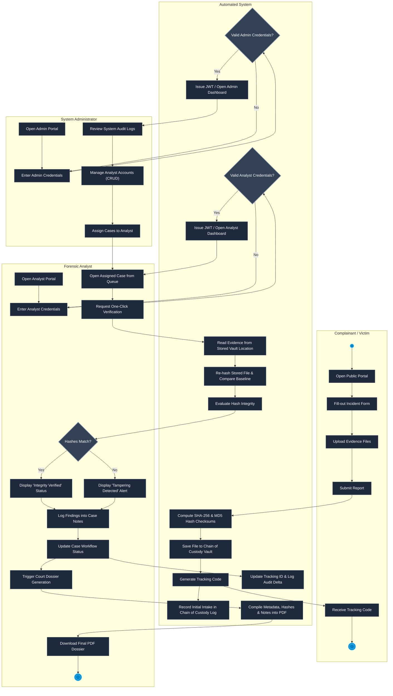
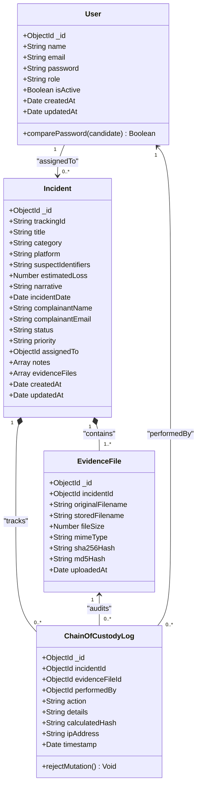
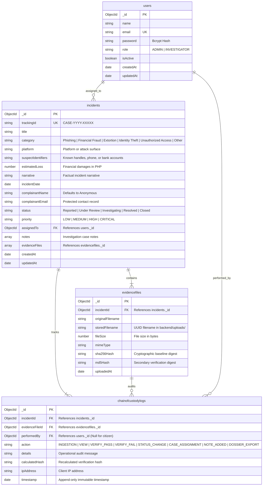

# CyberTrace: System Architecture & Design Diagrams

This document contains ready-to-use **Mermaid.js** diagram definitions for the CyberTrace Digital Forensic Incident Management System.

---

## 1. System Use Case Diagram

Models user roles (**Visitor / Citizen**, **Investigator / Forensic Analyst**, and **Administrator**) and their interactions with the system boundaries.

```mermaid
flowchart TD
    %% Actors
    subgraph Actors ["Stakeholder Roles"]
        Visitor["Citizen / Visitor\n(Public Reporter)"]
        Investigator["Forensic Investigator\n(Lead/Field Analyst)"]
        Admin["Administrator\n(SecOps Admin)"]
    end

    %% System Boundary
    subgraph CyberTraceSystem ["CyberTrace System Boundary"]
        UC1["Submit Incident Report\nwith Evidence File"]
        UC2["Receive Sequential Tracking Code\n(CASE-YYYY-XXXXX)"]
        UC3["Track Case Status Stepper\n(Sanitized Public View)"]
        
        UC4["Staff Authentication\n(Login via JWT)"]
        UC5["View Incident Triage Board\n& Apply Filters"]
        UC6["Inspect Case Dossier,\nEvidence & Audit Trail"]
        UC7["Verify Evidence File Integrity\n(On-Demand Recalculation)"]
        UC8["Stream / Download\nRaw Evidence File"]
        UC9["Add Internal Investigator Note"]
        UC10["Update Case Stage / Status"]
        UC11["Export Court-Ready\nForensic Dossier (PDF)"]

        UC12["Provision New\nInvestigator Accounts"]
        UC13["Inspect Global Immutable\nChain of Custody Ledger"]
    end

    %% Visitor Connections
    Visitor --> UC1
    Visitor --> UC2
    Visitor --> UC3

    %% Investigator Connections
    Investigator --> UC4
    Investigator --> UC5
    Investigator --> UC6
    Investigator --> UC7
    Investigator --> UC8
    Investigator --> UC9
    Investigator --> UC10
    Investigator --> UC11

    %% Admin Connections (Includes all Investigator capabilities + Admin specifics)
    Admin --> UC4
    Admin --> UC5
    Admin --> UC6
    Admin --> UC7
    Admin --> UC8
    Admin --> UC11
    Admin --> UC12
    Admin --> UC13

    %% Styling
    classDef actorStyle fill:#1e293b,stroke:#6366f1,stroke-width:2px,color:#f8fafc;
    classDef usecaseStyle fill:#0f172a,stroke:#334155,stroke-width:1.5px,color:#e2e8f0;
    class Visitor,Investigator,Admin actorStyle;
    class UC1,UC2,UC3,UC4,UC5,UC6,UC7,UC8,UC9,UC10,UC11,UC12,UC13 usecaseStyle;
```



---

## 2. Swimlane Activity Diagram: Evidence Intake & Ingestion Pipeline

Visualizes the transaction flow from public submission through memory-safe stream hashing to persistent storage in the disk vault and database.

```mermaid
sequenceDiagram
    autonumber
    actor Visitor as Citizen / Visitor
    participant API as Express API Layer<br/>(Multer & Controller)
    participant Crypto as Forensic Service<br/>(Native Node Crypto)
    participant Vault as Physical Vault<br/>(backend/uploads/)
    participant DB as MongoDB Database<br/>(Mongoose Models)

    Visitor->>API: POST /api/incidents/public (multipart form + evidence file)
    
    rect rgb(15, 23, 42)
        Note over API,Vault: Stream Storage Phase (O(1) RAM Consumption)
        API->>Vault: Multer streams incoming binary stream directly to disk
        Vault-->>API: File stored as UUID filename (e.g. 550e8400...pdf)
    end

    rect rgb(30, 41, 59)
        Note over API,Crypto: Dual Cryptographic Stream Hashing Phase
        API->>Crypto: computeFileHashes(physicalFilePath)
        Crypto->>Vault: fs.createReadStream(filePath)
        Crypto->>Crypto: Pipe data chunks simultaneously to SHA-256 & MD5 engines
        Crypto-->>API: Return { sha256: "hex...", md5: "hex..." }
    end

    rect rgb(15, 23, 42)
        Note over API,DB: Atomic Database Persistence & Immutability Ledger
        API->>DB: Count incidents & generate CASE-YYYY-XXXXX
        API->>DB: Incident.create({ trackingId, title, category, complainant, ... })
        API->>DB: EvidenceFile.create({ incidentId, originalFilename, storedFilename, sha256Hash, md5Hash })
        API->>DB: ChainOfCustodyLog.create({ evidenceId, incidentId, action: "INGESTION", role: "CITIZEN" })
        DB-->>API: Documents persisted successfully
    end

    API-->>Visitor: HTTP 201 Created { success: true, trackingId: "CASE-2026-XXXXX" }
```



---

## 3. Class Diagram

Defines the entity classes, Mongoose schema models, relationships, and immutability guardrails.

```mermaid
classDiagram
    class User {
# CyberTrace: Architecture & System Design Models

This specification outlines the structural, behavioral, and database design models for the CyberTrace Digital Forensic Incident Management System[span_0](start_span)[span_0](end_span).

---

## 1. System Use Case Diagram

Captures system boundaries, stakeholder interactions, and role-based permissions across public citizens, forensic analysts, and system administrators[span_1](start_span)[span_1](end_span).

```mermaid
flowchart TD
    %% Stakeholder Actors
    subgraph Stakeholders ["System Actors"]
        Citizen["Complainant / Citizen\n(Unauthenticated Reporter)"]
        Analyst["Forensic Analyst\n(Investigator)"]
        Admin["System Administrator\n(SecOps / User Manager)"]
    end

    %% Platform Boundary
    subgraph CyberTraceBoundary ["CyberTrace System Boundary"]
        UC1["Submit Incident & Upload Evidence Files"]
        UC2["Receive Anonymous Tracking Code\n(CASE-YYYY-XXXXX)"]
        UC3["Track Case Status & Review Stepper\n(Sanitized Public View)"]
        
        UC4["Authenticate via Staff JWT\n(Email & Bcrypt Password)"]
        UC5["View Case Queue & Apply Filters\n(Severity, Status, Category)"]
        UC6["Review Incident Details\n& Evidence Manifest"]
        UC7["Execute One-Click Hash Verification\n(On-Demand Disk Re-hash)"]
        UC8["Stream / Download Raw Evidence File"]
        UC9["Append Timestamped Case Note"]
        UC10["Update Case Workflow Status\n(Reported → Under Review → Investigating → Resolved)"]
        UC11["Export Court-Ready PDF Dossier"]

        UC12["Provision & Manage Staff Accounts"]
        UC13["Assign Incidents to Lead Analysts"]
        UC14["Inspect Global Chain of Custody Audit Ledger"]
    end

    %% Public Associations
    Citizen --> UC1
    Citizen --> UC2
    Citizen --> UC3

    %% Investigator Associations
    Analyst --> UC4
    Analyst --> UC5
    Analyst --> UC6
    Analyst --> UC7
    Analyst --> UC8
    Analyst --> UC9
    Analyst --> UC10
    Analyst --> UC11

    %% Administrator Associations
    Admin --> UC4
    Admin --> UC5
    Admin --> UC6
    Admin --> UC7
    Admin --> UC8
    Admin --> UC11
    Admin --> UC12
    Admin --> UC13
    Admin --> UC14

    %% Visual Styling
    classDef actorStyle fill:#0f172a,stroke:#3b82f6,stroke-width:2px,color:#f8fafc;
    classDef usecaseStyle fill:#1e293b,stroke:#475569,stroke-width:1px,color:#e2e8f0;
    class Citizen,Analyst,Admin actorStyle;
    class UC1,UC2,UC3,UC4,UC5,UC6,UC7,UC8,UC9,UC10,UC11,UC12,UC13,UC14 usecaseStyle;
```

---

## 2. Activity Diagram (4-Swimlane Operational Workflow)

Traces digital evidence custody from citizen intake through automated hashing to investigator review, verification, and PDF dossier generation[span_2](start_span)[span_2](end_span).



---

## 3. Sequence Diagram: On-Demand Evidence Integrity Verification

Visualizes the step-by-step verification pipeline when an investigator tests an evidence file against its baseline cryptographic hashes[span_3](start_span)[span_3](end_span).

```mermaid
sequenceDiagram
    autonumber
    actor Analyst as Forensic Analyst
    participant UI as Web Console (React)
    participant API as Express API Layer
    participant Service as Forensic Service (Node Crypto)
    participant Storage as Uploads Vault (backend/uploads/)
    participant DB as MongoDB (Mongoose)

    Analyst->>UI: Click "Verify Integrity"
    UI->>API: POST /api/evidence/:id/verify (Bearer JWT)
    
    rect rgb(15, 23, 42)
        Note over API,DB: Baseline Retrieval
        API->>DB: EvidenceFile.findById(id)
        DB-->>API: { sha256Hash: "e3b0c44...", storedFilename: "UUID.ext" }
    end

    rect rgb(30, 41, 59)
        Note over API,Storage: Non-Blocking Stream Recalculation
        API->>Service: computeFileHashes(filePath)
        Service->>Storage: fs.createReadStream(storedFilename)
        Storage-->>Service: Binary Data Chunks
        Service-->>API: Recalculated Checksums (SHA-256 & MD5)
    end

    rect rgb(15, 23, 42)
        Note over API,DB: Comparison & Immutable Custody Audit
        alt Hashes Match Baseline
            API->>DB: ChainOfCustodyLog.create({ action: "VERIFY_PASS" })
            API-->>UI: HTTP 200 { match: true, currentHash: "..." }
            UI-->>Analyst: Render Green "Integrity Verified" Badge
        else Hash Mismatch (Tampered File)
            API->>DB: ChainOfCustodyLog.create({ action: "VERIFY_FAIL" })
            API-->>UI: HTTP 200 { match: false, currentHash: "...", baselineHash: "..." }
            UI-->>Analyst: Render Red "Tampering Detected" Flag
        end
    end
```



---

## 4. Class Diagram

Defines domain entities, Mongoose model interfaces, methods, and application-layer immutability hooks[span_4](start_span)[span_4](end_span).



---

## 5. Database Entity Relationship Diagram (ERD)

Maps MongoDB collections, primary keys (`PK`), foreign keys (`FK`), unique constraints (`UK`), and data types[span_5](start_span)[span_5](end_span).



