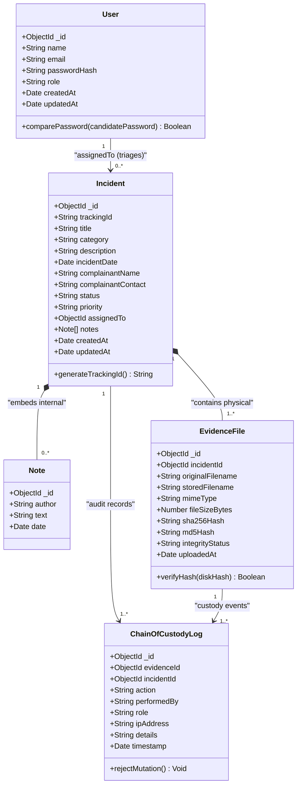
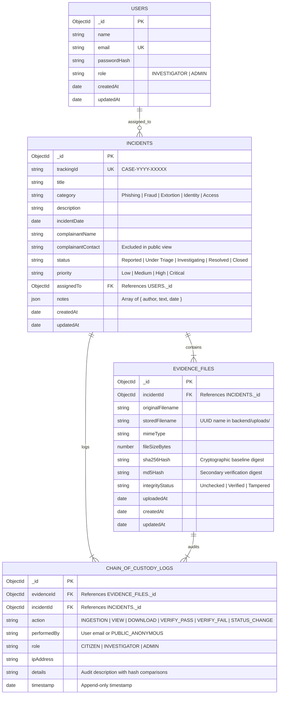

# CyberTrace: System Architecture & Design Diagrams

This document contains ready-to-use **Mermaid.js** diagram definitions for the CyberTrace Digital Forensic Incident Management System.

---

## 1. System Use Case Diagram

Models user roles (**Visitor / Citizen**, **Investigator / Forensic Analyst**, and **Administrator**) and their interactions with the system boundaries.

```mermaid
flowchart TD
    %% Actors
    subgraph Actors ["Stakeholder Roles"]
        Visitor["Citizen / Visitor\n(Public Reporter)"]
        Investigator["Forensic Investigator\n(Lead/Field Analyst)"]
        Admin["Administrator\n(SecOps Admin)"]
    end

    %% System Boundary
    subgraph CyberTraceSystem ["CyberTrace System Boundary"]
        UC1["Submit Incident Report\nwith Evidence File"]
        UC2["Receive Sequential Tracking Code\n(CASE-YYYY-XXXXX)"]
        UC3["Track Case Status Stepper\n(Sanitized Public View)"]
        
        UC4["Staff Authentication\n(Login via JWT)"]
        UC5["View Incident Triage Board\n& Apply Filters"]
        UC6["Inspect Case Dossier,\nEvidence & Audit Trail"]
        UC7["Verify Evidence File Integrity\n(On-Demand Recalculation)"]
        UC8["Stream / Download\nRaw Evidence File"]
        UC9["Add Internal Investigator Note"]
        UC10["Update Case Stage / Status"]
        UC11["Export Court-Ready\nForensic Dossier (PDF)"]

        UC12["Provision New\nInvestigator Accounts"]
        UC13["Inspect Global Immutable\nChain of Custody Ledger"]
    end

    %% Visitor Connections
    Visitor --> UC1
    Visitor --> UC2
    Visitor --> UC3

    %% Investigator Connections
    Investigator --> UC4
    Investigator --> UC5
    Investigator --> UC6
    Investigator --> UC7
    Investigator --> UC8
    Investigator --> UC9
    Investigator --> UC10
    Investigator --> UC11

    %% Admin Connections (Includes all Investigator capabilities + Admin specifics)
    Admin --> UC4
    Admin --> UC5
    Admin --> UC6
    Admin --> UC7
    Admin --> UC8
    Admin --> UC11
    Admin --> UC12
    Admin --> UC13

    %% Styling
    classDef actorStyle fill:#1e293b,stroke:#6366f1,stroke-width:2px,color:#f8fafc;
    classDef usecaseStyle fill:#0f172a,stroke:#334155,stroke-width:1.5px,color:#e2e8f0;
    class Visitor,Investigator,Admin actorStyle;
    class UC1,UC2,UC3,UC4,UC5,UC6,UC7,UC8,UC9,UC10,UC11,UC12,UC13 usecaseStyle;
```

---

## 2. Swimlane Activity Diagram: Evidence Intake & Ingestion Pipeline

Visualizes the transaction flow from public submission through memory-safe stream hashing to persistent storage in the disk vault and database.

```mermaid
sequenceDiagram
    autonumber
    actor Visitor as Citizen / Visitor
    participant API as Express API Layer<br/>(Multer & Controller)
    participant Crypto as Forensic Service<br/>(Native Node Crypto)
    participant Vault as Physical Vault<br/>(backend/uploads/)
    participant DB as MongoDB Database<br/>(Mongoose Models)

    Visitor->>API: POST /api/incidents/public (multipart form + evidence file)
    
    rect rgb(15, 23, 42)
        Note over API,Vault: Stream Storage Phase (O(1) RAM Consumption)
        API->>Vault: Multer streams incoming binary stream directly to disk
        Vault-->>API: File stored as UUID filename (e.g. 550e8400...pdf)
    end

    rect rgb(30, 41, 59)
        Note over API,Crypto: Dual Cryptographic Stream Hashing Phase
        API->>Crypto: computeFileHashes(physicalFilePath)
        Crypto->>Vault: fs.createReadStream(filePath)
        Crypto->>Crypto: Pipe data chunks simultaneously to SHA-256 & MD5 engines
        Crypto-->>API: Return { sha256: "hex...", md5: "hex..." }
    end

    rect rgb(15, 23, 42)
        Note over API,DB: Atomic Database Persistence & Immutability Ledger
        API->>DB: Count incidents & generate CASE-YYYY-XXXXX
        API->>DB: Incident.create({ trackingId, title, category, complainant, ... })
        API->>DB: EvidenceFile.create({ incidentId, originalFilename, storedFilename, sha256Hash, md5Hash })
        API->>DB: ChainOfCustodyLog.create({ evidenceId, incidentId, action: "INGESTION", role: "CITIZEN" })
        DB-->>API: Documents persisted successfully
    end

    API-->>Visitor: HTTP 201 Created { success: true, trackingId: "CASE-2026-XXXXX" }
```

---

## 3. Class Diagram

Defines the entity classes, Mongoose schema models, relationships, and immutability guardrails.

---

## 4. Database Entity Relationship Diagram (ERD)

Maps database collections, primary keys (`PK`), foreign keys (`FK`), and 1:N cardinalities.

