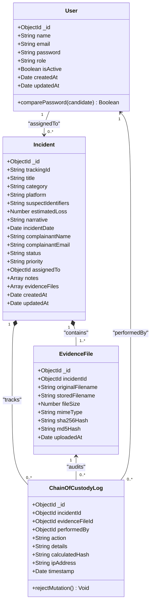
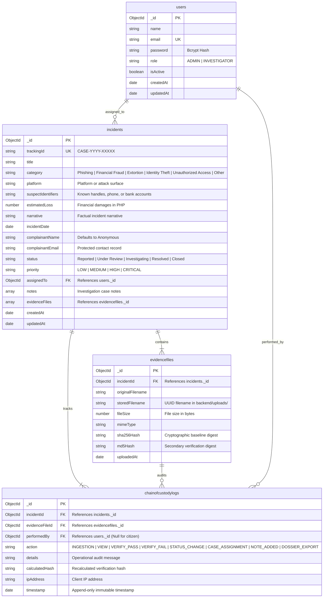

# CyberTrace: Architecture & System Design Models

This specification outlines the structural, behavioral, and database design models for the CyberTrace Digital Forensic Incident Management System[cite: 2].

---

## 1. System Use Case Diagram

Captures system boundaries, stakeholder interactions, and role-based permissions across public citizens, forensic analysts, and system administrators[cite: 2].

```mermaid
flowchart TD
    %% Stakeholder Actors
    subgraph Stakeholders ["System Actors"]
        Citizen["Complainant / Citizen\n(Unauthenticated Reporter)"]
        Analyst["Forensic Analyst\n(Investigator)"]
        Admin["System Administrator\n(SecOps / User Manager)"]
    end

    %% Platform Boundary
    subgraph CyberTraceBoundary ["CyberTrace System Boundary"]
        UC1["Submit Incident & Upload Evidence Files"]
        UC2["Receive Anonymous Tracking Code\n(CASE-YYYY-XXXXX)"]
        UC3["Track Case Status & Review Stepper\n(Sanitized Public View)"]
        
        UC4["Authenticate via Staff JWT\n(Email & Bcrypt Password)"]
        UC5["View Case Queue & Apply Filters\n(Severity, Status, Category)"]
        UC6["Review Incident Details\n& Evidence Manifest"]
        UC7["Execute One-Click Hash Verification\n(On-Demand Disk Re-hash)"]
        UC8["Stream / Download Raw Evidence File"]
        UC9["Append Timestamped Case Note"]
        UC10["Update Case Workflow Status\n(Reported → Under Review → Investigating → Resolved)"]
        UC11["Export Court-Ready PDF Dossier"]

        UC12["Provision & Manage Staff Accounts"]
        UC13["Assign Incidents to Lead Analysts"]
        UC14["Inspect Global Chain of Custody Audit Ledger"]
    end

    %% Public Associations
    Citizen --> UC1
    Citizen --> UC2
    Citizen --> UC3

    %% Investigator Associations
    Analyst --> UC4
    Analyst --> UC5
    Analyst --> UC6
    Analyst --> UC7
    Analyst --> UC8
    Analyst --> UC9
    Analyst --> UC10
    Analyst --> UC11

    %% Administrator Associations
    Admin --> UC4
    Admin --> UC5
    Admin --> UC6
    Admin --> UC7
    Admin --> UC8
    Admin --> UC11
    Admin --> UC12
    Admin --> UC13
    Admin --> UC14

    %% Visual Styling
    classDef actorStyle fill:#0f172a,stroke:#3b82f6,stroke-width:2px,color:#f8fafc;
    classDef usecaseStyle fill:#1e293b,stroke:#475569,stroke-width:1px,color:#e2e8f0;
    class Citizen,Analyst,Admin actorStyle;
    class UC1,UC2,UC3,UC4,UC5,UC6,UC7,UC8,UC9,UC10,UC11,UC12,UC13,UC14 usecaseStyle;
```

## 2. Class Diagram

Defines domain entities, Mongoose model interfaces, methods, and application-layer immutability hooks[cite: 2].

---

## 3. Database Entity Relationship Diagram (ERD)

Maps MongoDB collections, primary keys (`PK`), foreign keys (`FK`), unique constraints (`UK`), and data types[cite: 2].

